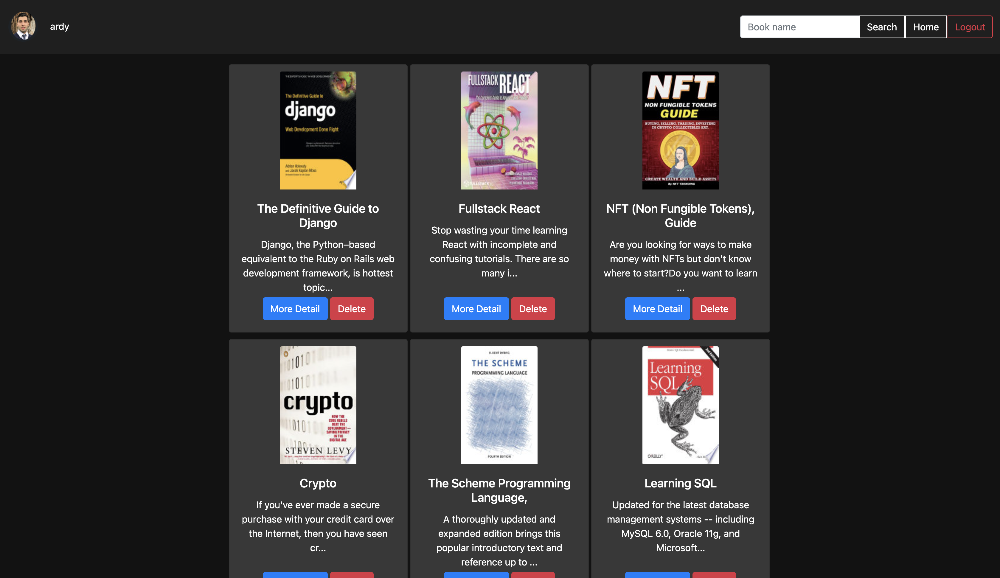
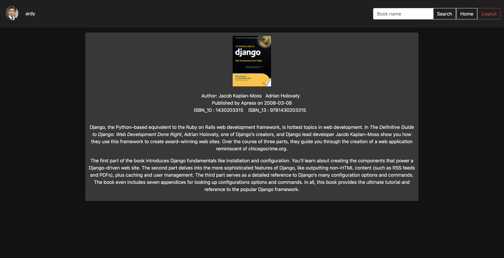
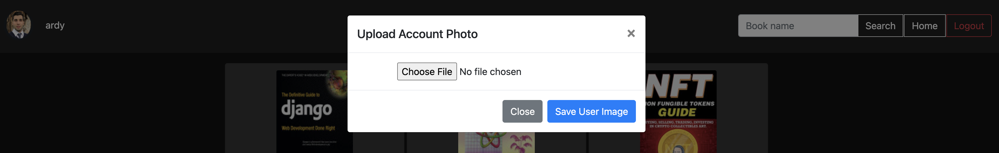

### Reading List 
#### A reading list application powered using google books API.

**Live Demo:** 
https://googleapireadinglist.herokuapp.com/
---

**Technologies Used:**

Django Framework is being used Topower the backend

Django's Template system is used to generate HTML dynamically. 

<p align="center">

</p>


**API Used:**
Google Books Api is used for querying book searches. 
<p align="center">

</p>


**Requests: HTTP for Humans™ 2.26.0**
<p align="center">

</p>


**python-dotenv 0.19.2** is used to load the api key from the env variables 


--- 

**Getting Started:**

```shell
    # AFTER ADDING YOUR GOOGLE API KEY TO THE ENV VARIABLE   
    # install pipenv if you haven't already    
    pip install pipenv 
    # activate the env     
    pipenv shell
    # run the server
    python manage.py runserver     
```

---
**Features:**

1. User can search for any books available on Google's database and add it to their reading list.

2. User can get more information on individual books. 

3. User can change their image



